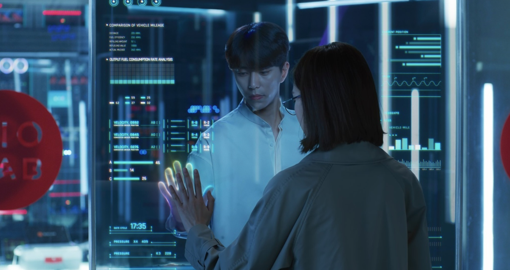

# Sofi_Portfolio

# [Information about me](https://github.com/Sof-max/portfolio.git)
* My name is Sofja Petrisheva
* I'm 17 years old
* Graduated from school in Russian and now I'm going to college in Vienna for a pastry chef

# Why am I here?
In our time, the world is developing very quickly, technology surpasses our dreams and many people become lonely. But what if technology helps people get closer or not be alone with themselves? What if someone could create an artificial intelligence that would not be different from a person and this intelligence could become an assistant and even a friend. This someone I want to become. It will be a long and arduous journey. But I am very interested in this idea.

